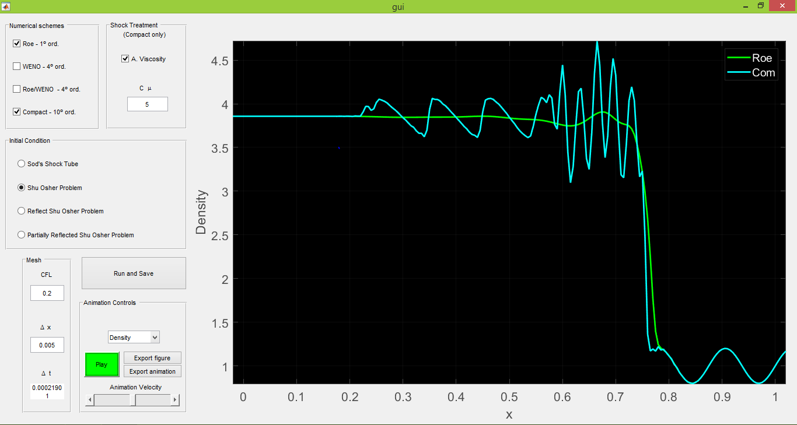

# GUI Euler
This GUI has the objective of showing how different numerical schemes used for solving the Euler equations may be (or not) suited for different situations where shocks and high frequency oscillations are present. Just run the gui.m file and you are good to go. After choosing a set of parameters, the simulations are performed and the output data is saved in your working directory. You can play an animation for those parameters after the simulations are done by pressing the button "Play". 

More details can be found on https://brenerstuff.com/gui-euler-equations-solver/.

